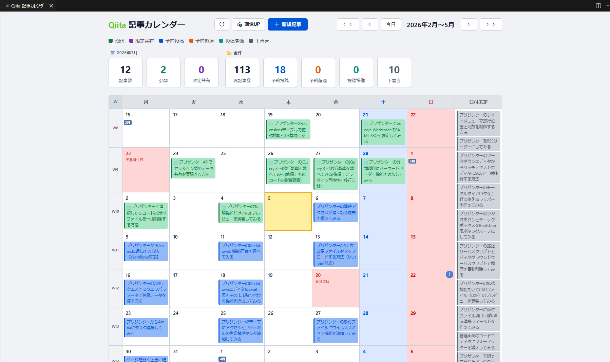
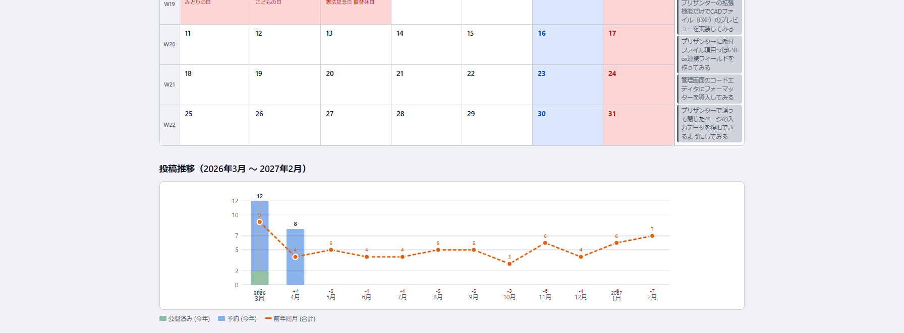
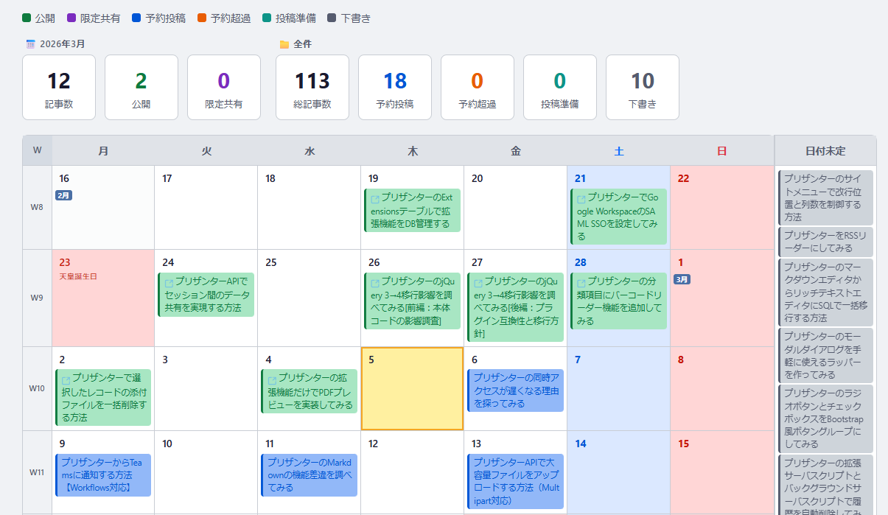
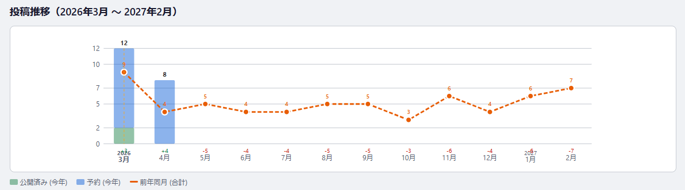
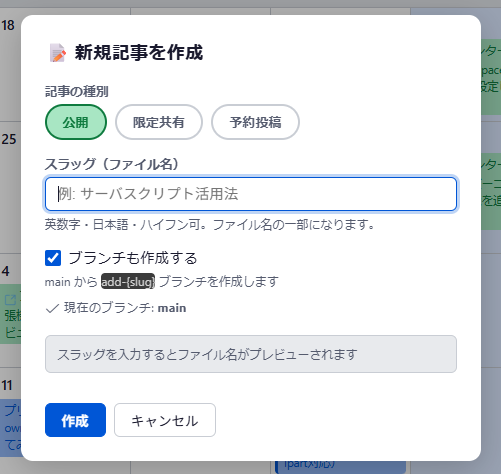
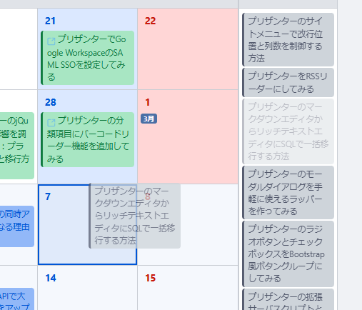
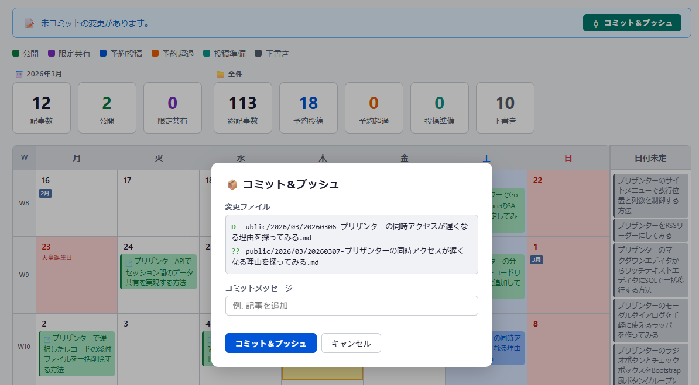
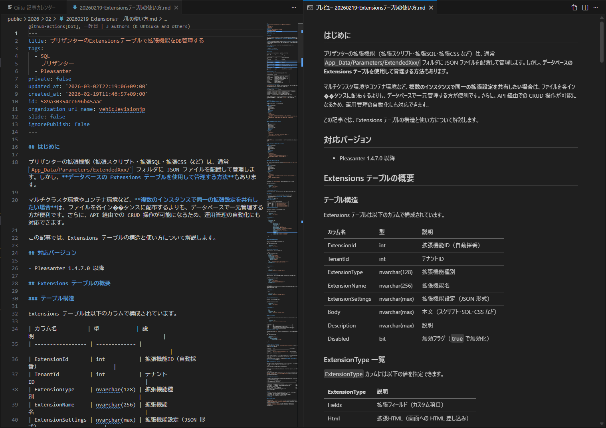
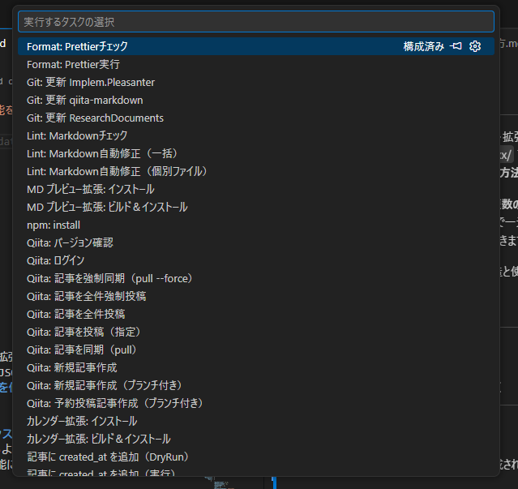

# VehicleVision.Tools.QiitaArticle

VS Code で Qiita 記事を楽に管理するためのツールキットです。  
記事の作成・プレビュー・Lint・投稿・予約公開まで、**すべて VS Code 上で完結**します。

## 特徴

### VS Code だけで完結する記事管理

- **ワークスペースを開くだけ** — `.vscode/extensions.json` により推奨拡張が自動提案され、すぐに環境が整う
- **記事カレンダー** — VS Code 内のカレンダー UI で記事の一覧表示・新規作成・日付変更・Git 操作まで完結
- **Qiita Markdown プレビュー** — `:::note` / `lang:filename` / 数式など Qiita 固有構文をそのままプレビュー
- **VS Code タスク** — Lint・Format・投稿・記事作成をコマンドパレットからワンクリック実行
- **Qiita 固有 Lint** — 7 つのカスタムルールで Qiita 記法を保存時にリアルタイム検証

### 自動化・CI/CD

- **記事作成の自動化** — ブランチ作成・ファイル配置・Front Matter 設定を1コマンドで完了
- **予約投稿** — `scheduled_publish` による日時指定の自動公開
- **GitHub Actions 連携** — `main` への push で自動公開 & Chatwork 通知

## 前提条件

- **Node.js** 20.0.0 以上
- **PowerShell** 7.0 以上（スクリプト実行用）
- **VS Code** 1.85.0 以上
- **Qiita アカウント** & アクセストークン

---

## 導入手順

### 1. リポジトリのクローン

```bash
git clone https://github.com/vehiclevisionjp/VehicleVision.Tools.QiitaArticle.git
cd VehicleVision.Tools.QiitaArticle
```

### 2. Node.js の確認

```bash
node -v   # v20.0.0 以上であること
npm -v
```

> **未インストールの場合:** [Node.js 公式サイト](https://nodejs.org/) から LTS 版をインストールしてください。

### 3. PowerShell の確認

```powershell
$PSVersionTable.PSVersion   # 7.0 以上であること
```

> **未インストール / バージョンが古い場合:**
>
> ```powershell
> # winget でインストール（推奨）
> winget install --id Microsoft.PowerShell --source winget
>
> # または公式サイトから: https://github.com/PowerShell/PowerShell/releases
> ```
>
> インストール後、VS Code の既定ターミナルを PowerShell 7 に変更してください:  
> `Ctrl+Shift+P` → `Terminal: Select Default Profile` → `PowerShell`

### 4. 依存パッケージのインストール

```bash
npm install
```

### 5. Qiita CLI にログイン

```bash
npx qiita login
```

Qiita の [アクセストークン設定画面](https://qiita.com/settings/tokens/new) で `read_qiita` / `write_qiita` スコープのトークンを発行し、入力してください。

> **⚠️ `npx qiita init` は実行しないでください。** このリポジトリには Qiita CLI の設定（`qiita.config.json`）やワークフロー（`.github/workflows/`）が既にセットアップ済みです。`qiita init` を実行すると設定ファイルが上書きされたり、別のワークフロー（`publish.yml`）が生成されて二重管理になります。必要なのは `npx qiita login` だけです。

### 6. VS Code 拡張機能のインストール

#### 推奨マーケットプレイス拡張

ワークスペースを開くと `.vscode/extensions.json` に基づいて推奨拡張が提案されます。

| 拡張 ID | 用途 |
|---------|------|
| `DavidAnson.vscode-markdownlint` | Markdown Lint の VS Code 統合 |
| `esbenp.prettier-vscode` | Prettier フォーマッタ |

#### カスタム拡張（ビルドが必要）

本リポジトリには 2 つのカスタム VS Code 拡張機能が含まれています。初回セットアップ時にビルド＆インストールしてください。

```powershell
# 記事カレンダー拡張のビルド＆インストール
.\scripts\Build-CalendarExtension.ps1

# Qiita Markdown プレビュー拡張のビルド＆インストール
.\scripts\Build-MarkdownPreview.ps1
```

インストール後、VS Code を再読み込み（`Ctrl+Shift+P` → `Reload Window`）してください。

VS Code タスクからも実行できます:

| タスク名 | 説明 |
|---------|------|
| カレンダー拡張: ビルド＆インストール | TypeScript ビルド → VSIX パッケージ → インストール |
| カレンダー拡張: インストール | ビルド済み VSIX のインストールのみ |
| MD プレビュー拡張: ビルド＆インストール | TypeScript ビルド → VSIX パッケージ → インストール |
| MD プレビュー拡張: インストール | ビルド済み VSIX のインストールのみ |

### 7. 動作確認

カレンダー拡張は、ワークスペースを開くと自動的にカレンダーパネルが表示されます。  
記事のプレビューは VS Code の Markdown プレビュー（`Ctrl+Shift+V`）で確認してください。

> **⚠️ `npx qiita preview` は使用しないでください。** Qiita CLI のプレビューサーバーは記事ファイルの Front Matter を上書きし、`scheduled_publish` や `created_at` 等のカスタムフィールドが削除されます。プレビューには必ず VS Code の Markdown プレビュー + Qiita Markdown プレビュー拡張を使用してください。

---

## VS Code で記事を管理する

このツールキットの主目的は、**VS Code を Qiita 記事の統合管理環境にする**ことです。  
ワークスペースを開くだけで、カレンダー・プレビュー・Lint・タスクが揃い、ターミナル操作を最小限に抑えて記事管理が完結します。

### .vscode/extensions.json（推奨拡張の自動提案）

ワークスペースを開くと、以下の拡張機能のインストールが自動的に提案されます:

| 拡張 ID | 用途 |
|---------|------|
| `DavidAnson.vscode-markdownlint` | Markdown Lint の VS Code 統合（カスタムルール連動） |
| `esbenp.prettier-vscode` | Prettier フォーマッタ（保存時自動フォーマット） |

この仕組みにより、チームメンバーがリポジトリをクローンして VS Code で開くだけで、必要な拡張が揃います。  
カスタム拡張（カレンダー・プレビュー）は Marketplace 未公開のため、導入手順のステップ 6 でビルド＆インストールしてください。

### 記事カレンダー拡張（VehicleVision.Tools.QiitaArticle.Calendar）




VS Code 内にカレンダー UI を表示し、記事の管理・作成・Git 操作をすべて GUI で行えます。  
ワークスペースを開くと自動的にカレンダーパネルが表示されます。

**主な機能:**

#### カレンダー表示・ステータス色分け



| 機能 | 説明 |
|------|------|
| 14 週カレンダー | 今日の 2 週間前〜12 週間先を一覧表示（週単位でスクロール） |
| ステータス色分け | 公開 / 限定共有 / 予約投稿 / 予約超過 / 投稿準備 / 下書きを色分け |
| 祝日表示 | 日本の祝日を自動取得して表示 |
| ファイル監視 | `public/` 配下の変更・ブランチ切替を検知して自動リロード |
| キーボード操作 | ← → で週移動、Escape でモーダルを閉じる |

#### 投稿推移グラフ



| 機能 | 説明 |
|------|------|
| 投稿推移グラフ | 直近 12 ヶ月の積み上げ棒グラフ（前年同期比付き） |

#### 新規記事作成



| 機能 | 説明 |
|------|------|
| 新規記事作成 | 公開 / 限定共有 / 予約投稿を GUI で作成（ブランチ自動作成対応） |

#### ドラッグ＆ドロップ



| 機能 | 説明 |
|------|------|
| ドラッグ＆ドロップ | 予約投稿・下書き記事の日付を D&D で変更 |

#### Git 操作



| 機能 | 説明 |
|------|------|
| Git 操作 | コミット / コミット＆プッシュ / マージ＆プッシュを GUI で実行 |

**ディレクトリ構成:**

```text
tools/VehicleVision.Tools.QiitaArticle.Calendar/
├── src/
│   ├── extension.ts       # エントリポイント（コマンド登録・自動起動）
│   ├── calendarPanel.ts   # Webview パネル管理（メッセージルーティング・記事操作）
│   ├── articleParser.ts   # 記事ファイルパーサー（Front Matter 解析）
│   ├── gitService.ts      # Git 操作（commit / merge / push / branch / status）
│   └── holidayService.ts  # 祝日取得（holidays-jp.github.io からキャッシュ付き取得）
├── media/
│   ├── app.js             # Webview フロントエンド（カレンダー・グラフ・モーダル）
│   ├── style.css          # Webview スタイルシート
│   ├── codicon.css        # VS Code Codicon フォント定義
│   └── codicon.ttf        # Codicon フォントファイル
├── package.json           # 拡張機能マニフェスト
└── tsconfig.json          # TypeScript 設定
```

**VS Code 設定:**

| 設定キー | デフォルト | 説明 |
|---------|-----------|------|
| `articleCalendar.autoOpen` | `true` | ワークスペースを開いたときにカレンダーを自動表示 |

### Qiita Markdown プレビュー拡張（VehicleVision.Tools.QiitaArticle.MarkdownPreview）



VS Code 標準の Markdown プレビューに Qiita 固有構文のサポートを追加します。  
`Ctrl+Shift+V` でプレビューを開くと、Qiita と同じ見た目で記事を確認できます。

| 構文 | 説明 |
|------|------|
| `:::note info\|warn\|alert` | ノートブロック（3 種類のスタイル） |
| `` ```lang:filename `` | コードブロックのファイル名ヘッダー表示 |
| `` ```math `` | 数式ブロック（VS Code の KaTeX と連携） |
| `` `#FF0000` `` | インラインカラーコード（色プレビュー付き） |
| 改行 | 自動 `<br>` 変換（Qiita と同じ挙動） |

**ディレクトリ構成:**

```text
tools/VehicleVision.Tools.QiitaArticle.MarkdownPreview/
├── src/
│   └── extension.ts             # MarkdownIt プラグイン（全構文の処理）
├── media/
│   └── qiita-markdown.css       # Qiita 風スタイル（ダークテーマ対応）
├── package.json                 # 拡張機能マニフェスト
└── tsconfig.json                # TypeScript 設定
```

### ビルドスクリプト共通仕様

| 項目 | 詳細 |
|------|------|
| バージョン自動生成 | `YYYY.MMDD.HHmm` 形式（ビルド日時ベース） |
| `-SkipBuild` | TypeScript ビルドをスキップ（パッケージング＆インストールのみ） |
| `-DryRun` | バージョン変更の表示のみ（実際のビルドは行わない） |
| `npm install` | `node_modules` が存在しない場合のみ自動実行 |

### VS Code タスク



VS Code の「タスクの実行」（`Ctrl+Shift+P` → `Tasks: Run Task`）からすべての操作を実行できます:

| カテゴリ | タスク名 | 説明 |
|---------|---------|------|
| **セットアップ** | npm: install | 依存パッケージのインストール |
| **セットアップ** | Qiita: ログイン | Qiita CLI にログイン |
| **記事管理** | Qiita: 新規記事作成 | スラッグを指定して記事ファイルを作成 |
| **記事管理** | Qiita: 新規記事作成（ブランチ付き） | ブランチ作成 + ファイル配置を自動化 |
| **記事管理** | Qiita: 予約投稿記事作成（ブランチ付き） | 予約投稿記事をブランチ付きで作成 |
| **投稿** | Qiita: 記事を投稿（指定） | 指定した記事を Qiita に投稿 |
| **投稿** | Qiita: 記事を全件投稿 | 公開対象の記事を一括投稿 |
| **投稿** | Qiita: 記事を全件強制投稿 | 全記事を強制的に再投稿 |
| **同期** | Qiita: 記事を同期（pull） | Qiita から記事をローカルに同期 |
| **同期** | Qiita: 記事を強制同期（pull --force） | ローカルの変更を破棄して同期 |
| **品質チェック** | Lint: Markdownチェック | markdownlint-cli2 で構文チェック |
| **品質チェック** | Lint: Markdown自動修正（一括） | 全記事の Lint エラーを自動修正 |
| **品質チェック** | Lint: Markdown自動修正（個別ファイル） | 開いているファイルのみ自動修正 |
| **品質チェック** | Format: Prettierチェック | Prettier でフォーマットチェック |
| **品質チェック** | Format: Prettier実行 | Prettier で自動フォーマット |
| **メンテナンス** | 記事ファイル名の日付同期（DryRun） | ファイル名の日付ズレを確認 |
| **メンテナンス** | 記事ファイル名の日付同期（実行） | ファイル名の日付を実際にリネーム |
| **メンテナンス** | 記事に created_at を追加（DryRun） | API から取得する created_at を確認 |
| **メンテナンス** | 記事に created_at を追加（実行） | Front Matter に created_at を追加 |
| **拡張機能** | カレンダー拡張: ビルド＆インストール | カレンダー拡張をビルドして VS Code にインストール |
| **拡張機能** | カレンダー拡張: インストール | ビルド済み VSIX を VS Code にインストール |
| **拡張機能** | MD プレビュー拡張: ビルド＆インストール | プレビュー拡張をビルドして VS Code にインストール |
| **拡張機能** | MD プレビュー拡張: インストール | ビルド済み VSIX を VS Code にインストール |
| **その他** | Qiita: バージョン確認 | Qiita CLI のバージョンを表示 |

---

## ディレクトリ構成

```text
├── public/                         # 記事ファイル（YYYY/MM/サブディレクトリ）
│   └── 2025/
│       └── 06/
│           └── 20250601-sample.md
├── scripts/                        # 管理スクリプト
│   ├── New-Article.ps1             # 新規記事作成
│   ├── New-ScheduledArticle.ps1    # 予約投稿記事作成
│   ├── Sync-ArticleDates.ps1      # ファイル名の日付同期
│   ├── Add-CreatedAt.ps1          # created_at の自動追加
│   ├── Build-CalendarExtension.ps1 # カレンダー拡張ビルド
│   └── Build-MarkdownPreview.ps1   # プレビュー拡張ビルド
├── tools/
│   ├── VehicleVision.Tools.QiitaArticle.Calendar/  # 記事カレンダー VS Code 拡張
│   │   ├── src/                    # TypeScript ソース
│   │   ├── media/                  # Webview 用 JS・CSS・フォント
│   │   └── package.json            # 拡張マニフェスト
│   └── VehicleVision.Tools.QiitaArticle.MarkdownPreview/  # Qiita Markdown プレビュー拡張
│       ├── src/                    # TypeScript ソース
│       ├── media/                  # CSS スタイル
│       └── package.json            # 拡張マニフェスト
├── .markdownlint-rules/           # Qiita 固有の Lint ルール
│   ├── _helpers.js                # 共通ユーティリティ
│   ├── qiita-front-matter.js      # QFM001: Front Matter 必須フィールド
│   ├── qiita-note-block.js        # QFM002: :::note ブロック構文
│   ├── qiita-code-block.js        # QFM003: コードブロック lang:filename
│   ├── qiita-math-block.js        # QFM004: 数式ブロック構文
│   ├── qiita-details-summary.js   # QFM005: details/summary 構文
│   ├── qiita-embed.js             # QFM006: 埋め込みホワイトリスト
│   └── qiita-inline-math.js       # QFM007: インライン数式構文
├── .github/workflows/
│   ├── push-publish.yml            # push 時の自動公開
│   └── scheduled-publish.yml       # 予約投稿の定期チェック
├── .vscode/tasks.json              # VS Code タスク定義
├── package.json
├── .markdownlint-cli2.jsonc
├── .prettierrc
└── qiita.config.json
```

## 記事のフォルダ管理

### ディレクトリ規則

記事ファイルは `public/YYYY/MM/` のサブディレクトリで年月別に管理します。

```text
public/
├── 2025/
│   ├── 06/
│   │   ├── 20250601-github-actions-intro.md
│   │   └── 20250615-qiita-cli-tips.md
│   └── 12/
│       └── 20251220-year-in-review.md
└── 2026/
    └── 03/
        └── 20260305-new-article.md
```

### ファイル命名規則

ファイル名は `YYYYMMDD-タイトル.md` の形式です。

| 要素 | 形式 | 例 |
|------|------|-----|
| 日付プレフィックス | `YYYYMMDD` | `20260305` |
| 区切り | `-`（ハイフン） | — |
| タイトル部分 | 英数字・ハイフン・アンダースコア | `github-actions-intro` |

- スクリプトで記事を作成すると、タイトル中のスペースは `_` に、不正文字は `-` に自動変換されます
- 予約投稿記事は `scheduled_publish` の日付がプレフィックスになります
- 投稿後は `Sync-ArticleDates.ps1` で実際の投稿日（`created_at`）に合わせてリネームできます

### Front Matter と公開制御

各記事の先頭にある Front Matter で公開状態を制御します。

```yaml
---
title: 記事タイトル
tags:
  - Qiita
private: false
slide: false
id: null                     # Qiita 投稿後に自動設定される記事 ID
organization_url_name: null
ignorePublish: true          # true: 未公開（作成直後）/ false: 公開対象
scheduled_publish: "2026-04-01"  # 予約投稿日（省略可）
---
```

| フィールド | 用途 |
|-----------|------|
| `ignorePublish: true` | Qiita CLI の `publish --all` で公開されない（下書き状態） |
| `ignorePublish: false` | 次回の `publish` で Qiita に公開される |
| `scheduled_publish` | GitHub Actions が日付到来時に `ignorePublish` を `false` に切り替える |

### 記事のライフサイクル

```
作成 → 執筆 → PR & マージ → 自動公開 → 日付同期
```

1. `New-Article.ps1` でブランチ・ファイルを作成（`ignorePublish: true`）
2. 記事を執筆し、Lint・Format で品質チェック
3. `ignorePublish: false` に変更して PR を作成
4. `main` にマージされると GitHub Actions が Qiita に自動公開
5. `Sync-ArticleDates.ps1` で投稿日にファイル名を同期（任意）

---

## スクリプト詳細

### New-Article.ps1 — 新規記事作成

ブランチ作成からファイル配置・Front Matter 設定までを自動化します。

**パラメータ:**

| パラメータ | 必須 | デフォルト | 説明 |
|-----------|------|-----------|------|
| `-Title` | ✅ | — | 記事スラッグ（英数字・日本語・ハイフン推奨） |
| `-Visibility` | — | `public` | 公開設定（`public` / `private`） |

**実行例:**

```powershell
# 公開記事を作成
.\scripts\New-Article.ps1 -Title "github-actions-intro"

# 限定共有記事を作成
.\scripts\New-Article.ps1 -Title "internal-guide" -Visibility private
```

**処理フロー:**

1. `main` ブランチに切り替え & `git pull` で最新化
2. `add-YYYYMMDD-タイトル` ブランチを作成
3. `npx qiita new` で記事テンプレートを生成
4. `public/YYYY/MM/` サブディレクトリに移動
5. `ignorePublish: true` に設定（`private` 指定時は `private: true` も設定）

### New-ScheduledArticle.ps1 — 予約投稿記事作成

指定日に自動公開される予約投稿記事を作成します。

**パラメータ:**

| パラメータ | 必須 | デフォルト | 説明 |
|-----------|------|-----------|------|
| `-Date` | ✅ | — | 投稿予定日（`YYYY-MM-DD` 形式、明日以降） |
| `-Title` | ✅ | — | 記事タイトル（英数字・ハイフン推奨） |

**実行例:**

```powershell
.\scripts\New-ScheduledArticle.ps1 -Date "2026-04-01" -Title "spring-release-notes"
```

**処理フロー:**

1. 日付バリデーション（明日以降であること）
2. `main` ブランチに切り替え & 最新化
3. `add-YYYYMMDD-タイトル` ブランチを作成
4. `npx qiita new` で記事テンプレートを生成
5. `public/YYYY/MM/` サブディレクトリに移動
6. Front Matter に `ignorePublish: true` と `scheduled_publish: "YYYY-MM-DD"` を設定

予約日が到来すると、`scheduled-publish.yml` ワークフローが `ignorePublish` を `false` に変更して自動公開します。

### Sync-ArticleDates.ps1 — ファイル名の日付同期

ファイル名の日付プレフィックス（YYYYMMDD）を Front Matter の情報に基づいてリネームします。

**パラメータ:**

| パラメータ | 必須 | デフォルト | 説明 |
|-----------|------|-----------|------|
| `-DryRun` | — | `$false` | 変更内容の表示のみ（実際のリネームは行わない） |
| `-Force` | — | `$false` | 確認プロンプトなしで実行 |

**実行例:**

```powershell
# まずドライランで確認
.\scripts\Sync-ArticleDates.ps1 -DryRun

# 確認なしで実行（CI 向け）
.\scripts\Sync-ArticleDates.ps1 -Force
```

**同期ルール:**

| 条件 | 日付の取得元 |
|------|-------------|
| 予約投稿記事（`ignorePublish: true` + `scheduled_publish` あり） | `scheduled_publish` の日付 |
| 投稿済み記事（`id` が設定済み） | `created_at`（なければ `updated_at` にフォールバック） |

- ファイル名が `99999999` で始まる記事（日付未定）はスキップ
- 日付変更に伴いサブディレクトリ（`YYYY/MM`）も自動的に移動
- 移動先に同名ファイルがある場合はスキップ

### Add-CreatedAt.ps1 — created_at の自動追加

Qiita API から投稿日時を取得し、Front Matter に `created_at` フィールドを追加します。

**パラメータ:**

| パラメータ | 必須 | デフォルト | 説明 |
|-----------|------|-----------|------|
| `-DryRun` | — | `$false` | API 取得結果の表示のみ（ファイル更新は行わない） |

**実行例:**

```powershell
# ドライランで確認
.\scripts\Add-CreatedAt.ps1 -DryRun

# 実行
.\scripts\Add-CreatedAt.ps1
```

**動作詳細:**

- Qiita CLI の認証情報（`~/.config/qiita-cli/credentials.json`）を使用
- `id` が設定済みで `created_at` がない記事のみを対象
- `updated_at` の次行に `created_at: '...'` を挿入
- API レート制限対策として 1 記事ごとに 1 秒待機

---

## 品質チェック

### Lint（構文チェック）

```bash
# Markdown Lint を実行
npm run lint

# 自動修正つき
npm run lint:fix
```

### フォーマット

```bash
# Prettier でフォーマットチェック
npm run format:check

# 自動フォーマット
npm run format
```

### プレビュー

VS Code の Markdown プレビュー（`Ctrl+Shift+V`）で確認してください。  
Qiita Markdown プレビュー拡張をインストール済みであれば、Qiita 固有構文も正しくレンダリングされます。

> **⚠️ `npx qiita preview` は使用禁止です。** Front Matter が破壊されます（詳細は [qiita preview / pull で Front Matter が壊れる問題](#%EF%B8%8F-qiita-pull--preview-%E3%81%A7-front-matter-%E3%81%8C%E5%A3%8A%E3%82%8C%E3%82%8B%E5%95%8F%E9%A1%8C)）。

---

## GitHub Actions（CI/CD）

> **ℹ️ ワークフローはサンプルとして同梱しています。**  
> `.github/workflows/` 内のファイルは `.yml.sample` 拡張子で無効化されています。  
> 有効化するには拡張子を `.yml` にリネームしてください:
>
> ```bash
> mv .github/workflows/push-publish.yml.sample .github/workflows/push-publish.yml
> mv .github/workflows/scheduled-publish.yml.sample .github/workflows/scheduled-publish.yml
> ```

このリポジトリでは **GitHub → Qiita への一方向同期** を前提としています。  
記事の作成・編集はすべてローカルの Git リポジトリで行い、`main` へのマージで自動公開されます。

### `qiita pull` がほぼ不要な理由

Qiita CLI には `npx qiita pull` でリモートの記事をローカルに取り込む機能がありますが、このワークフローでは **基本的に不要** です。

- 記事の作成・編集はすべてローカルの Markdown ファイルで行う（**Git が正**）
- 投稿後に Qiita が自動付与する `id`・`updated_at` は、CI が `created_at` と共にコミットして push するため、ローカルには `git pull` で反映される
- Qiita の Web エディタで直接編集した場合のみ `qiita pull` が必要になるが、このワークフローではそのケースを想定しない

> **TL;DR:** 記事は Git で管理し、Qiita はビューア兼公開先として扱う。`qiita pull` は初回インポートやリカバリ用として残しています。

### ⚠️ `qiita pull` / `qiita preview` で Front Matter が壊れる問題

> **`npx qiita pull` および `npx qiita preview` は通常運用では使用しないでください。** Front Matter が破壊されます。

`qiita pull` や `qiita preview` を実行すると、Qiita サーバー側の記事データでローカルファイルが上書きされます。その際、以下の問題が発生します:

| 問題 | 詳細 |
|------|------|
| **カスタムフィールドの消失** | `scheduled_publish`、`created_at` など Qiita が認識しないフィールドが削除される |
| **ディレクトリ構造の破壊** | `public/YYYY/MM/` のサブディレクトリ配置が無視され、`public/` 直下にフラットに展開される |
| **`ignorePublish` のリセット** | ローカルで `true` に設定していた下書き記事が `false` に書き換わり、意図しない公開が起きる可能性がある |
| **ファイル名の変更** | `YYYYMMDD-タイトル.md` の命名規則が Qiita 側のスラッグで上書きされる |

**もし `qiita pull` や `qiita preview` を実行してしまった場合:**

```bash
# 変更を確認
git diff

# Front Matter が壊れていたら全て元に戻す
git checkout -- public/
```

**`qiita pull` が必要になるケース（稀）:**

- 既存の Qiita アカウントの記事を初めてこのリポジトリに取り込む場合
- Qiita の Web エディタで直接編集してしまい、その変更をローカルに反映したい場合

いずれの場合も、pull 後に `git diff` で差分を確認し、カスタムフィールドやディレクトリ構造を手動で復元してください。

### Qiita CLI コマンド比較

Qiita CLI が提供するコマンドと、このツールキットでの対応・代替を比較します。

| Qiita CLI コマンド | 機能 | このツールキットでの扱い |
|-------------------|------|------------------------|
| `npx qiita new <slug>` | 記事テンプレート生成 | ✅ `New-Article.ps1` / `New-ScheduledArticle.ps1` が内部で使用。ブランチ作成・ディレクトリ配置・Front Matter 設定を自動化 |
| `npx qiita preview` | ローカルプレビュー | ⛔ **使用禁止** — Front Matter が破壊される。VS Code の Markdown プレビュー（`Ctrl+Shift+V`）を使用 |
| `npx qiita publish <slug>` | 指定記事を投稿 | ⚡ CI が自動実行。手動投稿も VS Code タスクから可能 |
| `npx qiita publish --all` | 全記事を一括投稿 | ⚡ CI が `main` への push 時に自動実行 |
| `npx qiita pull` | Qiita → ローカル同期 | ⛔ **非推奨** — Front Matter が壊れるため通常は使用しない |
| `npx qiita pull --force` | 強制同期（ローカル上書き） | ⛔ **非推奨** — 上記と同様。初回インポート・リカバリ時のみ |
| `npx qiita login` | 認証トークン設定 | ✅ 初回セットアップで使用 |
| `npx qiita version` | バージョン表示 | ✅ VS Code タスクに登録済み |

### 機能比較 — Qiita CLI 単体 vs このツールキット

| 機能 | Qiita CLI 単体 | このツールキット |
|------|---------------|----------------|
| 記事の作成 | `qiita new` で `public/` 直下に生成 | スクリプトで `public/YYYY/MM/` に自動配置 + ブランチ作成 |
| 記事の公開 | 手動で `qiita publish` を実行 | `main` への push で自動公開（CI） |
| 予約投稿 | ❌ 非対応 | ✅ `scheduled_publish` + GitHub Actions で自動化 |
| 公開通知 | ❌ 非対応 | ✅ Chatwork / Slack 等に自動通知 |
| Front Matter 管理 | `id`・`updated_at` のみ自動付与 | `created_at` も CI が自動追加 |
| ファイル整理 | フラット管理（`public/` 直下） | 年月別サブディレクトリで整理 |
| 構文チェック | ❌ 非対応 | ✅ Qiita 固有記法の Lint（7 ルール） |
| コードフォーマット | ❌ 非対応 | ✅ Prettier による自動フォーマット |
| ブランチ運用 | ❌ 非対応 | ✅ 記事ごとにブランチを自動作成 |
| Qiita → ローカル同期 | `qiita pull` で同期 | ❌ 非推奨（Git が正。`git pull` で CI の変更を取得） |

### push-publish.yml — push 時の自動公開

`main` ブランチへの push 時に `public/` 配下の変更を検知し、自動的に Qiita に公開します。

**トリガー:**

| トリガー | 条件 |
|---------|------|
| `push` | `main` / `master` ブランチで `public/**` に変更があった場合 |
| `workflow_dispatch` | GitHub Actions の UI から手動実行 |

**処理ステップ:**

```
checkout → publish → created_at 追加 → 変更通知の組み立て → 通知送信
```

1. `increments/qiita-cli/actions/publish@v1` で記事を Qiita に公開
2. 新規投稿された記事に Qiita API から `created_at` を取得して Front Matter に追記し、自動コミット & push
3. 公開された記事のタイトル・URL を収集して通知メッセージを生成
4. 通知サービスに送信（デフォルト: Chatwork）
5. ワークフロー失敗時はエラー通知を送信

**同時実行制御:**
- `concurrency` 設定により同一ワークフローの並行実行を防止
- `cancel-in-progress: false` で実行中のジョブはキャンセルしない（記事の二重投稿防止）

### scheduled-publish.yml — 予約投稿の定期チェック

毎日定時に実行され、`scheduled_publish` の日付が到来した記事を自動公開します。

**スケジュール:**

| cron | 日本時間 |
|------|---------|
| `0 0 * * *` | JST 9:00 |
| `0 9 * * *` | JST 18:00 |

**処理ステップ:**

```
checkout → 予約日チェック → ignorePublish 切替 → commit & push → publish → created_at 追加 → レポート通知
```

1. `public/` 配下の全記事を走査し、`scheduled_publish` の日付が今日以前の記事を検出
2. 該当記事の `ignorePublish` を `true` → `false` に変更し、`scheduled_publish` 行を削除
3. 変更をコミット & push
4. Qiita CLI で公開
5. `created_at` を取得して Front Matter に追記
6. **日次レポート** を通知（本日投稿した記事一覧 + 今後の予約予定）

### 必要な Secrets

| Secret 名 | 用途 | 必須 |
|-----------|------|------|
| `QIITA_TOKEN` | Qiita API アクセストークン | ✅ |
| `CHATWORK_API_TOKEN` | Chatwork API トークン（通知用） | 通知を使う場合 |
| `CHATWORK_ROOM_ID` | Chatwork ルーム ID（通知先） | 通知を使う場合 |

> Qiita トークンは [Qiita の設定画面](https://qiita.com/settings/tokens/new) から `read_qiita` / `write_qiita` スコープで発行してください。

### 通知のカスタマイズ（Chatwork → Slack 等への載せ替え）

デフォルトでは Chatwork に通知を送信していますが、通知部分は独立したステップになっているため、他のサービスに簡単に載せ替えられます。

**通知ステップの構造:**

どちらのワークフローも以下の 2 ステップで通知を構成しています:

1. **メッセージ組み立てステップ**（`id: articles`） — 公開された記事の情報を `steps.articles.outputs.message` に格納
2. **通知送信ステップ**（`Notify Chatwork` / `Notify Chatwork on failure`） — 組み立てたメッセージを送信

載せ替えるには **送信ステップだけを差し替え** ればOKです。メッセージの組み立てロジックはそのまま使えます。

**Slack に載せ替える例:**

```yaml
# --- 変更前（Chatwork）---
- name: Notify Chatwork
  if: steps.articles.outputs.message != ''
  env:
    CHATWORK_API_TOKEN: ${{ secrets.CHATWORK_API_TOKEN }}
    CHATWORK_ROOM_ID: ${{ secrets.CHATWORK_ROOM_ID }}
  run: |
    curl -X POST "https://api.chatwork.com/v2/rooms/${CHATWORK_ROOM_ID}/messages" \
      -H "X-ChatWorkToken: ${CHATWORK_API_TOKEN}" \
      --data-urlencode "body=${{ steps.articles.outputs.message }}"

# --- 変更後（Slack Incoming Webhook）---
- name: Notify Slack
  if: steps.articles.outputs.message != ''
  env:
    SLACK_WEBHOOK_URL: ${{ secrets.SLACK_WEBHOOK_URL }}
  run: |
    curl -X POST "$SLACK_WEBHOOK_URL" \
      -H "Content-Type: application/json" \
      -d "{\"text\": \"${{ steps.articles.outputs.message }}\"}"
```

> **ポイント:**
>
> - Chatwork のメッセージ装飾（`[info]`・`[title]`）は Chatwork 固有記法です。Slack に載せ替える場合は、メッセージ組み立てステップの `[info][title]...[/title]...[/info]` を Slack の `mrkdwn` 形式（`*太字*`、`>` 引用など）に書き換えてください
> - 失敗通知ステップ（`Notify Chatwork on failure`）も同様に差し替えが必要です
> - 通知が不要な場合は、`Notify` で始まるステップをすべて削除し、Secrets の設定も不要になります

## カスタム Lint ルール

| ルール ID | 名前 | 検証内容 |
|----------|------|---------|
| QFM001 | `qiita-front-matter` | 必須 Front Matter フィールドの存在チェック |
| QFM002 | `qiita-note-block` | `:::note` ブロックの構文・サブタイプ検証 |
| QFM003 | `qiita-code-block` | コードブロック `lang:filename` 記法の検証 |
| QFM004 | `qiita-math-block` | `$$` / `` ```math `` ブロックの開閉対応検証 |
| QFM005 | `qiita-details-summary` | `<details>` / `<summary>` の対応検証 |
| QFM006 | `qiita-embed` | 埋め込み iframe/script のホワイトリスト検証 |
| QFM007 | `qiita-inline-math` | インライン数式 `$`\``...\``$` の構文検証 |

## ライセンス

[AGPL-3.0](LICENSE)
